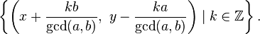

# POJ Solutions

My solutions to [POJ](http://poj.org).

## 1000 --- A + B Problem

Click [here](http://poj.org/problem?id=1000) to see the question.

Nothing to say.

## 1001 --- Exponentiation

Click [here](http://poj.org/problem?id=1001) to see the question.

Arbitrary precision arithmatic problem. The key point is to calculate the exponentiation by the equation shown below:

## 1018 --- Communication Network

Click [here](http://poj.org/problem?id=1018) to see the question.

Enumerating all possible bandwidths and finding the lowest price for each bandwidth could simplify this question.

## 1061 --- 青蛙的约会

Click [here](http://poj.org/problem?id=1061) to see the question.

本来以为是简单的追及问题，后来发现不是，原因有两个：

1. 不知道两只青蛙相差的距离到底是多少，因为有可能会在若干圈之后追上，导致实际上追及距离的不确定。
1. 每一次跳动是离散的，不像传统的追及问题，跑步时运动是连续的，两个人只要速度不一样，总会有追上的时候。而青蛙跳动时，有可能两只青蛙分别在不同的状态之间跳跃，导致两只青蛙永远都无法相遇。（例如：x = 1, y = 2, m = 2, n = 4, L = 4)

既然如此，就只能用“笨办法”了。经过观察，可以这样表示这一问题：x + mk ≡ y + nk (mod L)，其中k ∈ Z。经过变换，可以表示成如下形式：(m - n)k + Lq = y - x，其中k ∈ Z，q ∈ Z。我们需要求这一方程的解中，k取最小正值时的值。如果令a = m - n，b = L，c = y - x，则这一方程可以表示为ak + bq = c，恰为[线性丢番图方程](https://en.wikipedia.org/wiki/Diophantine_equation#Linear_Diophantine_equations)。可以通过[扩展欧几里德算法](https://en.wikipedia.org/wiki/Extended_Euclidean_algorithm)求得方程的一组特解，进而求出方程的通解。

根据[裴蜀定理](https://en.wikipedia.org/wiki/B%C3%A9zout%27s_identity)，当且仅当gcd(a, b) | c时，方程ax + by = c有解，且有无穷多组解。此时，若一组特解为x = x_0, y = y_0，则方程的通解为：

。

这样一来，我们至少知道应该如何判断青蛙是否能够相遇了，如果c恰好是gcd(a, b)的话，这个问题也可以按照上面的公式解决，但是如果c是gcd(a, b)的倍数该怎么办？

不妨设scale = c / gcd(a, b)，则原方程中的通解如果都扩大scale倍，则问题解决。
